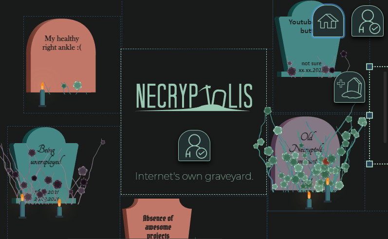

    

## Internet's own graveyard

👋 Welcome to repo for Flow contracts of Necryptolis.

- Necryptolis is an NFT graveyard, build with **Cadence**, smart contract programming language for Flow blockchain.
- The platform allows you to create cemetery plots, design and put a headstone, light a candle or trim the weeds and, finally, bury another NFT.

Testnet application is deployed to: https://dev.necryptolis.com

Testnet contract is deployed to: https://flow-view-source.com/testnet/account/0xe14302dca59353b0/contract/Necryptolis

### Additional info

- Tests are failing only in CI, but work locally.
- Application is deployed to Azure
